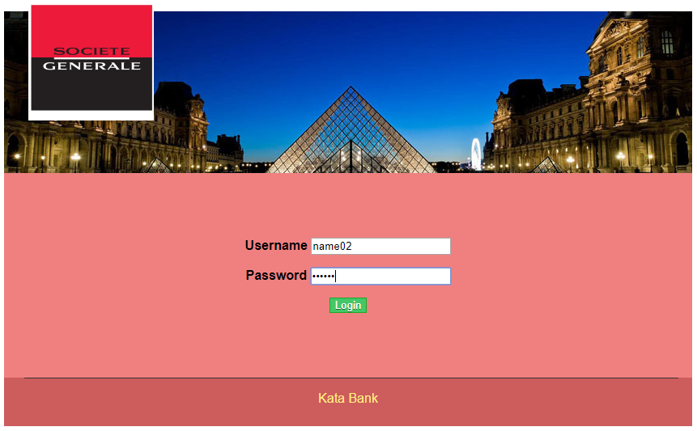

# Kata Bank

This is project for Kata Bank 

This web application is created to simulate the basic operations of bank; A classical user can check his accounts and see the history of 
each account. He can deposit or withdraw his money with this Kata bank, each sucessful operation is recorded to database and with this
web application, user can check all of his transactions. 

First, user have to enter his Username and Passord to Login the Kata Bank.

In the folder src/sql you can see the script SQL to create the database for Kata Bank, also the raw data for User, Account, Transaction.
Here, we use Username : name02 and Password : pass02 to login into Kata Bank.

Then, he can see the list of his accounts with their corresponding total balance and opened date. 
His personal information is displayed also on User board with name, adresse, email.

User can click on the Account Number to go the the board of this account, there he can see all the transactions linked to the account.
The information of Account is displayed: Account number, Total Balance and the Overdraft (Autorisation de découvert) of User (here, the
default is 0 Euro)

The user can return to the list of his accounts or choose to print all the transitions'history on this chosen account by clicking on the
button 'Printer'.

At the bottom, user can see the tool to realize his basic operations : Deposit and Withdraw

When he realize his operation, he is redirected to a confirmation page or a warning page in which he is informated that the operation is 
valid or not.

If the operation is valid, he can see the forecast balance in case he still want to realize this operation. He can always choose to return account board or finally confirm his operation.

When he return the account board, he can see his new transaction is well recorded to the Kata Bank. The Total Balance of the account is well updated also.

If the operation is not valid (error typing input, invali input amount, invalid account's overdraft.. )

User is informed by a warning message and he can return to account board.

Example of Withdraw :

At any moment during his session, the user can always choose to Log out of Kata Bank by clicking the Button Log out on top right of website.

Tuan Hiep TRAN
